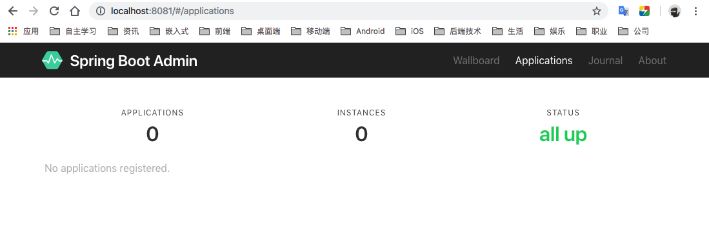
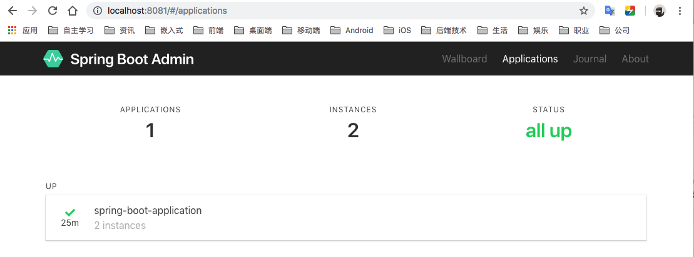

# springboot2-admin

Spring Boot 2.x 监控中心 Admin 的简单使用demo。

## 简介


Spring Boot Admin 是一个管理和监控 Spring Boot 应用程序的开源项目。

分为admin-server 与 admin-client 两个组件，admin-server通过采集 actuator 端点数据，显示在spring-boot-admin-ui 上，已知的端点几乎都有进行采集，通过 spring-boot-admin 可以动态切换日志级别、导出日志、导出heapdump、监控各项指标。

Spring Boot Admin 在对单一应用服务监控的同时也提供了集群监控方案，支持通过eureka、consul、zookeeper等注册中心的方式实现多服务监控与管理。

这里主要演示对单一应用服务监控。

## 服务端集成（admin-server）

在pom.xml文件中导入 admin-server 包

```xml
<dependency>
	<groupId>de.codecentric</groupId>
	<artifactId>spring-boot-admin-starter-server</artifactId>
</dependency>
```

在 ServerApplication 里面添加启动配置 `@EnableAdminServer`

```java
@SpringBootApplication
@EnableAdminServer
public class AdminServerApplication {

	public static void main(String[] args) {
		SpringApplication.run(AdminServerApplication.class, args);
	}
}

```

在 application.properties 中添加端口配置，定义 admin-server 运行在 8081 端口。


```
server.port=8081
```


启动服务，访问地址： 

http://localhost:8081

可以看到服务端已经起来了：



## 客户端集成（admin-client）


在pom.xml文件中导入 admin-server 包

```xml
<dependency>
    <groupId>de.codecentric</groupId>
    <artifactId>spring-boot-admin-starter-client</artifactId>
</dependency>
```

在 application.properties 中添加端口配置，定义 admin-server 运行在 8081 端口。

```
server.port=8080
spring.boot.admin.client.url=http://localhost:8081
management.endpoints.web.exposure.include=*
```


启动服务，访问地址： 

http://localhost:8081

可以看到服务端已经起来了,并且可以监控到客户端


